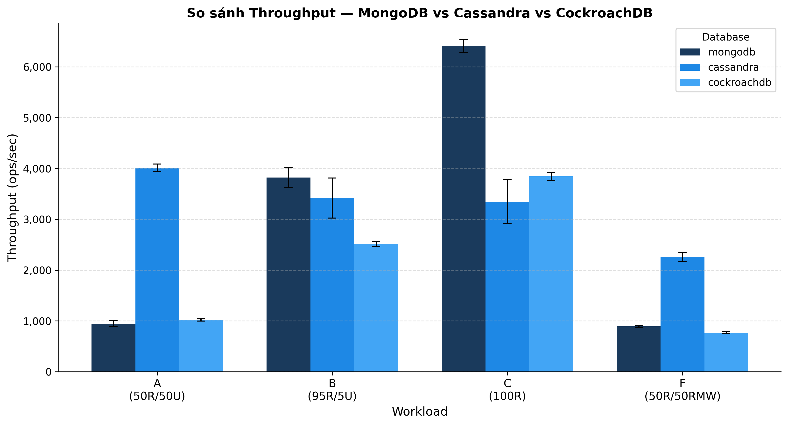
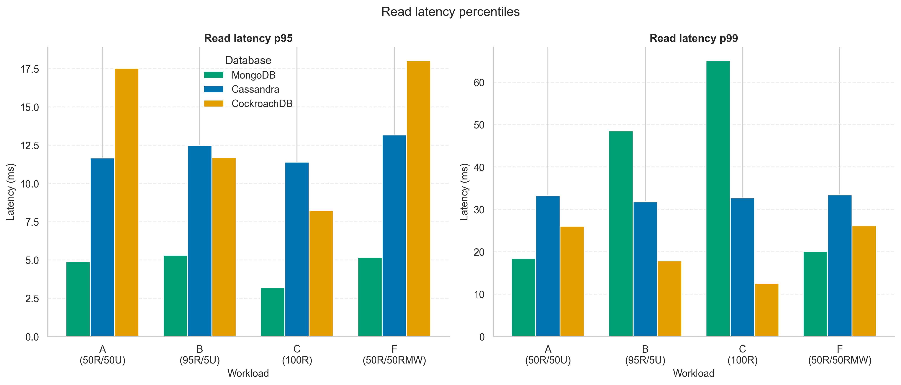
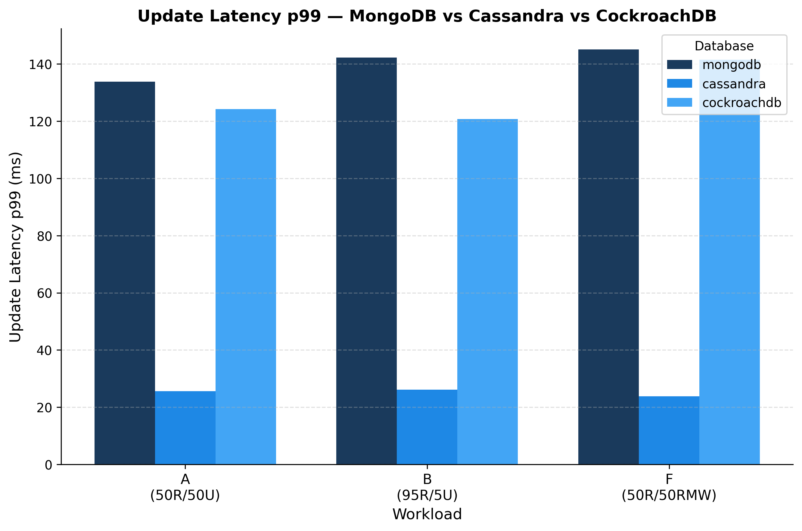
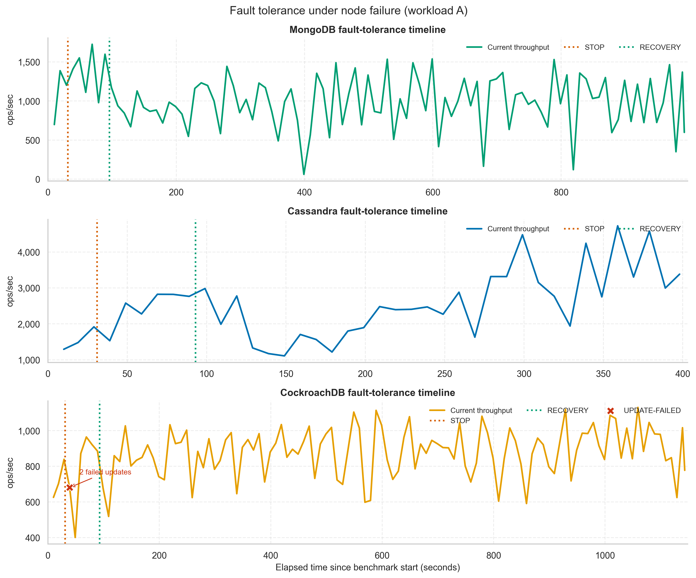
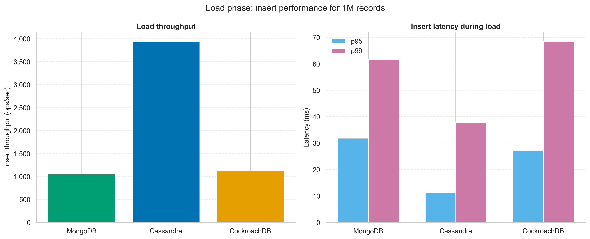
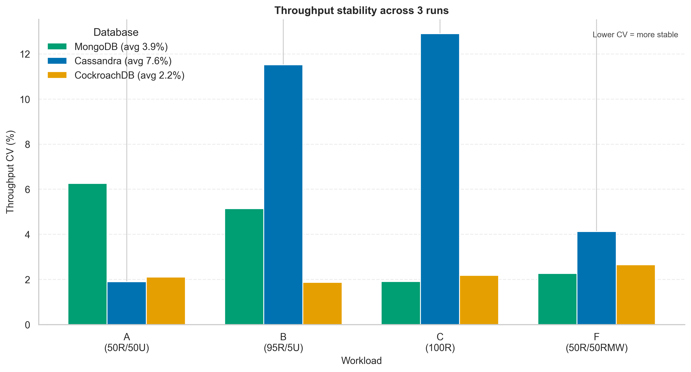

# YCSB Benchmark — Distributed Database Performance Evaluation

> **Đánh giá hiệu năng xử lý dữ liệu lớn của các hệ cơ sở dữ liệu phân tán (NoSQL và NewSQL) thông qua thực nghiệm YCSB**

Đồ án liên môn — **Cơ sở dữ liệu phân tán (IS211.Q22) + Dữ liệu lớn (IS405.Q23)**
Đại học Công nghệ Thông tin — VNU-HCM (UIT)
GVHD: ThS. Nguyễn Hồ Duy Trí
Bài báo cơ sở: Dritsas & Trigka (2025), "Database Systems in the Big Data Era," *IEEE Access*.

## Nhóm thực hiện

| Họ tên | MSSV | Vai trò |
|--------|------|---------|
| Phạm Anh Quốc | 23521307 | Infrastructure (Docker, YCSB runner), benchmark, fault tolerance, parse data |
| Trần Thanh Huy | 23520649 | Lý thuyết (Chương 2), visualize, phân tích kết quả (Chương 4.4) |

## Hệ thống đánh giá

| Hệ thống | Version | Paradigm | Topology |
|----------|---------|----------|----------|
| MongoDB | 7.0 | Document NoSQL | Replica Set 3-node (PRIMARY + 2 SECONDARY) |
| Apache Cassandra | 4.1 | Column-family NoSQL | Masterless 3-node, RF=3 |
| CockroachDB | v23.2.4 | NewSQL distributed SQL | 3-node Raft consensus |

## Trạng thái dự án

- [x] Phase 0 — Environment setup (Docker, WSL2, Java 11, YCSB 0.17)
- [x] Phase 1 — Repo structure
- [x] Phase 2 — 3 cluster + YCSB runner pipeline verified
- [x] Phase 3 — Workload configs + run scripts + parse_logs.py
- [x] Phase 4 — Benchmark 1M + fault tolerance (MongoDB, Cassandra, CockroachDB)
- [x] Phase 5 — Visualize + phân tích kết quả
- [x] Phase 6 — Viết báo cáo

## Kết quả Throughput (ops/sec, trung bình 3 runs, 1M records, threadcount=16)

| Workload | MongoDB | Cassandra | CockroachDB | Mô tả |
|----------|--------:|----------:|------------:|-------|
| A (50/50 read/update) | 942 | **4011** | 1019 | mixed |
| B (95/5 read/update) | **3823** | 3419 | 2514 | read-heavy |
| C (100% read) | **6405** | 3347 | 3842 | read-only |
| F (50/50 read/RMW) | 893 | **2258** | 771 | read-modify-write |

(in đậm = cao nhất mỗi workload)

**Tóm tắt phát hiện:**
- **Cassandra** thắng workload ghi nhiều (A, F) — kiến trúc LSM-tree tối ưu cho ghi.
- **MongoDB** thắng workload đọc nhiều (B, C) — B-tree index + cache đọc hiệu quả.
- **CockroachDB** throughput vừa phải nhưng độ biến thiên thấp nhất (CV ~2%) — đánh đổi cho ACID + strong consistency qua Raft.

## Kết quả Fault Tolerance (workload A, dừng 1 node giữa benchmark)

| | MongoDB | Cassandra | CockroachDB |
|--|---------|-----------|-------------|
| Operation bị fail? | Không | Không | **Có (UPDATE-FAILED)** |
| Throughput thấp nhất khi node down | ~490 | ~1100 | ~401 |
| Latency spike tối đa | 5-7s | ~2s | ~4s |
| Cơ chế chịu lỗi | majority ack (PRIMARY phục vụ) | RF=3, CL=ONE | Raft leader re-election |
| Xu hướng CAP | CP-leaning | **AP** | **CP (strict)** |

→ Ba hệ thống thể hiện ba hành vi CAP khác biệt rõ rệt — minh chứng thực nghiệm cho trade-off lý thuyết.

## Biểu đồ kết quả

Notebook visualize: `analysis/notebooks/visualize_ycsb.ipynb`  
Output hình: `analysis/results/figures/` (`.png` dùng cho báo cáo Word, `.svg` dùng cho slide).

### Throughput tổng quan



### Latency đọc/ghi

<p align="center">
  
  
</p>

### Fault tolerance

Biểu đồ này tách riêng 3 timeline vì thời lượng benchmark khác nhau giữa các DB. CockroachDB có điểm `UPDATE-FAILED`, thể hiện rõ trade-off CP khi node bị dừng.



### Load phase và độ ổn định

<p align="center">
  
  
</p>

## Kiến trúc thực nghiệm

```
Windows host (24GB RAM, 8 core)
└── Docker Desktop (WSL2, 16GB RAM)
    ├── ycsb-mongo-rs-net      → 3 MongoDB containers
    ├── ycsb-cass-cluster-net  → 3 Cassandra containers
    ├── ycsb-crdb-cluster-net  → 3 CockroachDB containers
    └── ycsb-runner:0.17.0     → join network của DB cần benchmark
```

YCSB chạy **trong container** (image `ycsb-runner:0.17.0`), join chung Docker network với DB → resolve hostname nội bộ qua Docker DNS, tránh vướng port-mapping NAT của Docker Desktop trên Windows.

## Yêu cầu môi trường

| Tool | Version | Ghi chú |
|------|---------|---------|
| Docker Desktop | 24.0+ với WSL2 | Cấp ≥ 16GB RAM cho WSL2 (`~/.wslconfig`) |
| Java | 11 (Temurin) | Runner image tự bundle Java 11 |
| Python | 3.11+ | Cho parse + visualize; notebook đã verify với Python 3.13 trên Windows |
| Python packages | pandas, matplotlib, seaborn, notebook | Cho notebook visualize |
| Git Bash | (kèm Git for Windows) | Để chạy script `.sh` trên Windows |

## Quick Start

### 1. Build YCSB runner image (1 lần, ~25-30 phút)

```bash
docker build -t ycsb-runner:0.17.0 ./docker/ycsb-runner
```

### 2. Khởi động cluster + tạo schema

**MongoDB:**
```bash
cd docker/mongodb && docker compose up -d
docker exec ycsb-mongo1 mongosh --quiet --eval "rs.initiate({_id:'ycsb-rs',members:[{_id:0,host:'mongo1:27017',priority:2},{_id:1,host:'mongo2:27017',priority:1},{_id:2,host:'mongo3:27017',priority:1}]})"
```
MongoDB tự tạo collection — không cần schema.

**Cassandra:**
```bash
cd ../cassandra && docker compose up -d
# Đợi 5-8 phút (3 node UN), rồi:
docker exec ycsb-cass1 cqlsh -e "CREATE KEYSPACE IF NOT EXISTS ycsb WITH replication={'class':'SimpleStrategy','replication_factor':3}; CREATE TABLE IF NOT EXISTS ycsb.usertable (y_id varchar PRIMARY KEY, field0 varchar, field1 varchar, field2 varchar, field3 varchar, field4 varchar, field5 varchar, field6 varchar, field7 varchar, field8 varchar, field9 varchar);"
# QUAN TRỌNG: tăng write timeout để tránh insert timeout lúc load 1M (xem docs/DEVELOPMENT_LOG.md)
docker exec ycsb-cass1 nodetool settimeout write 10000
docker exec ycsb-cass2 nodetool settimeout write 10000
docker exec ycsb-cass3 nodetool settimeout write 10000
```

**CockroachDB:**
```bash
cd ../cockroachdb && docker compose up -d
docker exec ycsb-crdb1 cockroach init --insecure --host=crdb1:26257
docker exec ycsb-crdb1 cockroach sql --insecure --host=crdb1:26257 -e "CREATE DATABASE IF NOT EXISTS ycsb; USE ycsb; CREATE TABLE IF NOT EXISTS usertable (ycsb_key VARCHAR(255) PRIMARY KEY, field0 TEXT, field1 TEXT, field2 TEXT, field3 TEXT, field4 TEXT, field5 TEXT, field6 TEXT, field7 TEXT, field8 TEXT, field9 TEXT);"
```

### 3. Chạy benchmark (Git Bash, 1 DB tại 1 thời điểm)

Smoke test trước (verify pipeline, ~5 phút):
```bash
cd ycsb/scripts
RECORDCOUNT=10000 OPERATIONCOUNT=10000 RUNS=1 THREADCOUNT=4 bash run_mongodb.sh
```

Full benchmark (1M records, 3 runs):
```bash
bash run_mongodb.sh       # ~2-4 tiếng
bash run_cassandra.sh     # ~2-4 tiếng
bash run_cockroachdb.sh   # ~3-5 tiếng
```

### 4. Fault tolerance (sau benchmark, data 1M còn trong DB)

```bash
bash run_fault_tolerance.sh mongodb
bash run_fault_tolerance.sh cassandra
bash run_fault_tolerance.sh cockroachdb
```

### 5. Parse logs → CSV

```bash
cd analysis
python parse_logs.py
```

Output: `analysis/results/summary/summary_raw.csv` (36 dòng) + `summary_mean.csv` (12 dòng).

### 6. Visualize bằng notebook

Nếu dùng Windows Python Launcher:

```powershell
py -3.13 -m pip install pandas matplotlib seaborn notebook
py -3.13 -m notebook analysis\notebooks\visualize_ycsb.ipynb
```

Hoặc mở trực tiếp `analysis/notebooks/visualize_ycsb.ipynb` bằng VS Code/Jupyter và chọn **Run All**.

Notebook sẽ đọc dữ liệu từ `analysis/results/`, vẽ lại 6 biểu đồ và lưu PNG/SVG vào `analysis/results/figures/`.

## Cấu trúc repo

```
ycsb-benchmark/
├── docker/
│   ├── mongodb/  cassandra/  cockroachdb/  ycsb-runner/
├── ycsb/
│   ├── workloads/   # workload_a/b/c/f.properties
│   └── scripts/     # common.sh, run_*.sh, run_fault_tolerance.sh
├── analysis/
│   ├── parse_logs.py
│   ├── results/
│   │   ├── mongodb/  cassandra/  cockroachdb/   # logs + fault logs
│   │   ├── summary/  # summary_raw.csv, summary_mean.csv
│   │   └── figures/  # PNG/SVG visualizations
│   └── notebooks/    # visualize_ycsb.ipynb
├── docs/
│   └── DEVELOPMENT_LOG.md   # nhật ký kỹ thuật
└── report/                  # báo cáo + references
```

## Tài liệu

- `docs/DEVELOPMENT_LOG.md` — Nhật ký kỹ thuật: môi trường, lỗi đã gặp + cách fix, design decisions, kết quả
- `analysis/notebooks/visualize_ycsb.ipynb` — Notebook tạo 6 biểu đồ và ghi chú phân tích
- `ycsb/scripts/README.md` — Hướng dẫn chi tiết chạy benchmark

Repo: https://github.com/PhamAnhQuoc-HTTT/ycsb-benchmark
